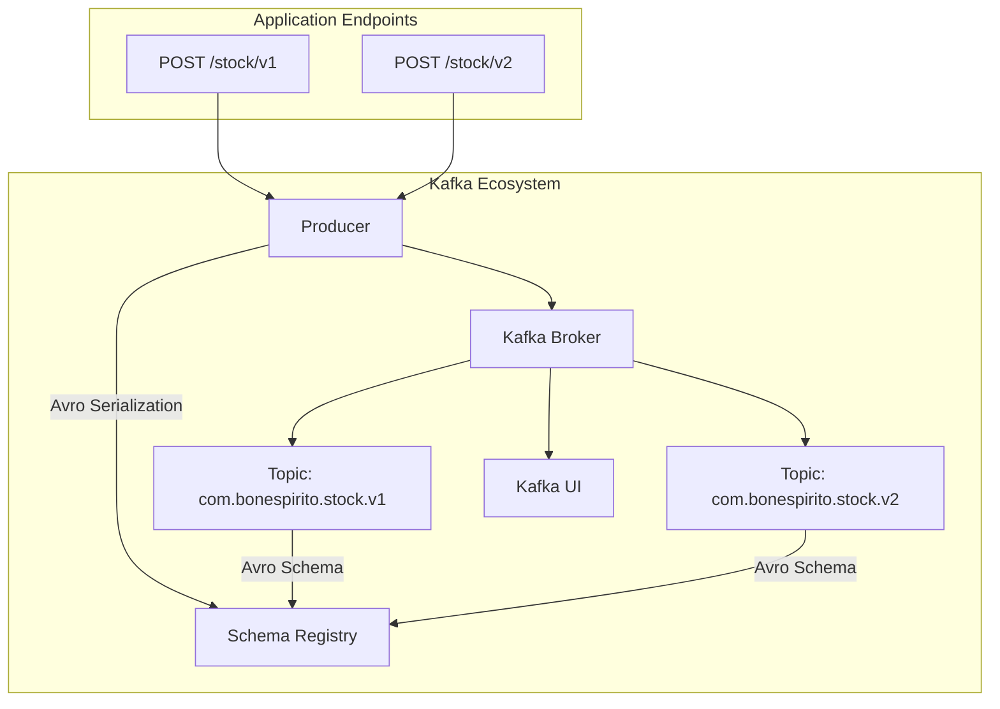

# Kafka Proof of Concept

This project is a Spring Boot application demonstrating Kafka integration with Avro serialization. It includes a Kafka producer that sends messages to different Kafka topics using Avro-generated keys and values.

## Table of Contents

*   [Prerequisites](#prerequisites)
*   [Getting Started](#getting-started)
*   [Kafka Setup (Docker Compose)](#kafka-setup-docker-compose)
*   [Workflow](#workflow)
*   [Running the Application](#running-the-application)
*   [API Endpoints](#api-endpoints)
*   [Avro Schemas](#avro-schemas)
*   [Kafka UI](#kafka-ui)

## Prerequisites

Before you begin, ensure you have the following installed:

*   **Java Development Kit (JDK) 17 or higher**
*   **Gradle 8.x or higher**
*   **Docker Desktop** (for running Kafka and related services)

## Getting Started

1.  **Clone the repository:**

    ```bash
    git clone https://github.com/your-repo/kafka-poc.git
    cd kafka-poc
    ```

2.  **Build the project:**

    ```bash
    ./gradlew clean build
    ```

## Kafka Setup (Docker Compose)

This project uses Docker Compose to set up a local Kafka environment, including Kafka, Kafka UI, REST Proxy, and Schema Registry.

1.  **Navigate to the project root directory.**
2.  **Start the Docker Compose services:**

    ```bash
    docker compose -f docker/docker-compose.yaml up -d
    ```

    This command will start the following services:
    *   `kafka`: Kafka broker
    *   `kafka-ui`: Web UI for managing Kafka (accessible at `http://localhost:8080`)
    *   `rest-proxy`: Confluent REST Proxy for Kafka
    *   `schema-registry`: Confluent Schema Registry

3.  **Verify services are running:**

    You can check the status of your Docker containers:

    ```bash
    docker ps
    ```

## Workflow



## Running the Application

Once the Kafka services are up and running, you can start the Spring Boot application:

```bash
./gradlew bootRun
```

The application will start on `http://localhost:8090`.

## API Endpoints

The application exposes the following REST endpoints for producing Kafka messages:

### 1. Produce to `com.bonespirito.stock.v1` topic

*   **Endpoint:** `POST /stock/v1`
*   **Description:** Sends a `StockValue` message to the `com.bonespirito.stock.v1` topic. The key for this message is derived from `StockValue.skuCode`.
*   **Example Request (using curl):**

    ```bash
    curl -X POST http://localhost:8090/stock/v1
    ```

    This endpoint internally creates a `StockValue` object with predefined data and sends it to Kafka.

### 2. Produce to `com.bonespirito.stock.v2` topic

*   **Endpoint:** `POST /stock/v2`
*   **Description:** Sends a `StockKey` and `StockValue` message to the `com.bonespirito.stock.v2` topic. Both the key and value are Avro-serialized.
*   **Example Request (using curl):**

    ```bash
    curl -X POST http://localhost:8090/stock/v2
    ```

    This endpoint internally creates `StockKey` and `StockValue` objects with predefined data and sends them to Kafka.

## Avro Schemas

The project uses Avro for serializing Kafka message keys and values. The Avro schema definitions are located in `src/main/avro/`:

*   `stock-key.avsc`: Defines the schema for `StockKey`.
*   `stock-value.avsc`: Defines the schema for `StockValue`.

These schemas are used by the `gradle-avro-plugin` to generate corresponding Java classes in `build/generated-main-avro-java/`.

## Kafka UI ([UI for Apache Kafka](https://github.com/provectus/kafka-ui))

You can access the Kafka UI at `http://localhost:8080/ui`.

### `com.bonespirito.stock.v1` Topic Messages

#### Key for `com.bonespirito.stock.v1`


#### Value for `com.bonespirito.stock.v1`


### `com.bonespirito.stock.v2` Topic Messages

#### Key for `com.bonespirito.stock.v2`


#### Value for `com.bonespirito.stock.v2`

